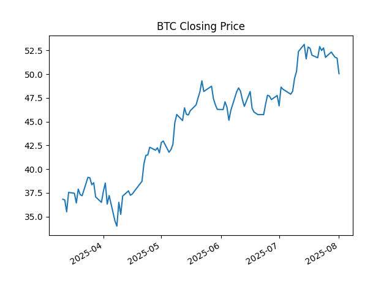

# Financial Report for BTC

## AI Recommendation

The provided data shows a relatively small price range for Bitcoin (BTC) over a short period (March 11th-17th, 2025).  The prices are all in the low to mid $30s, indicating a relatively stable, though slightly bearish, trend.

Let's break down the observations:

* **Slight Downward Trend:**  Overall, there's a slight downward trend from March 11th to March 17th.  While the fluctuations aren't drastic, the price is generally lower at the end of the period.

* **Minor Fluctuations:** The price fluctuates within a range of approximately $2.34. This suggests some volatility, but nothing exceptionally significant.

* **Lack of Context:**  The provided data is insufficient for a thorough analysis.  To understand the trend properly, we need significantly more data points, including longer-term price history.  A single week's worth of data doesn't provide enough information to determine any significant long-term trend or predict future price movements.  Factors like market sentiment, regulatory changes, and technological developments also influence price, and are not reflected in this limited data.

* **Potential for Reversal:** The slight uptick from March 13th to March 12th could indicate a temporary price bounce. However, without further data, it's impossible to determine if this is a significant reversal or just short-term fluctuation.

**In conclusion:** Based on this limited data, the trend is slightly bearish, but it's too short a period to draw any meaningful conclusions about long-term market behavior.  More data is needed for a robust analysis.  This data alone would not be sufficient to inform any trading decisions.
